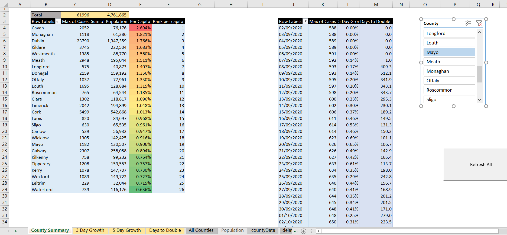

# COVID19 Irish County Data

Simple python script which downloads and compiles all county level data into a single csv file. 

This app breaks occasionally when the format of the press release changes unexpectedly. 

## Analysis
An excel sheet I've made for looking at some high level statistics. 

## Data
Data gathered from [Gov.ie Analysis of COVID19 Cases](https://www.gov.ie/en/collection/ef2560-analysis-of-confirmed-cases-of-covid-19-coronavirus-in-ireland/)